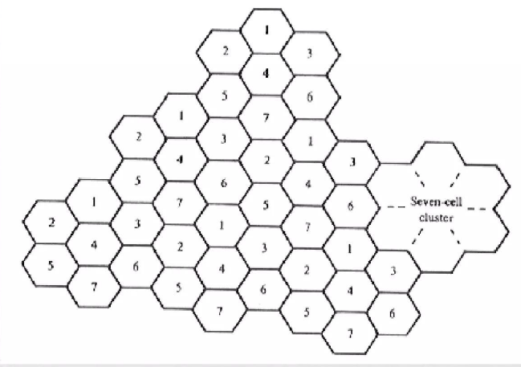

# Cluster

A cluster is a group of hexagonal cells packed together such that no two adjacent cells use the same frequency. The same set of frequencies is used once per cluster.

---

## 📌 Key Points:

- Possible cluster sizes are 1, 3, 4, 7, 9, 12, etc.  
- Frequencies can only be reused outside the cluster, not within the same cluster  
- The most commonly used cluster size in GSM is 7 (called a 7-cell cluster)  

---

## 🔁 7-Cell Cluster Concept:

In a 7-cell cluster, cells are numbered 1 to 7, and the same pattern repeats again in the next cluster. Cells with the same number in different clusters use the same frequencies — but they are far enough apart that they don't interfere with each other.

## 🖼️ Figure:

# 📐 Why hexagon shape?

Cells shapes are hexagons because:

• Each cell has 6 equal-distance neighbors  
• Angles between them are 60°  
• This makes planning and frequency reuse easier  

---

# Cluster Size & Cell Layout

## 📊 Valid Cluster Size (N):

N is not allowed for every number. It must follow this formula:

N = i² + ij + j²  

Here, i and j = 0, 1, 2, 3... (non-negative integers).

---

## 📌 Examples:

• i=1, j=1 → N = 3  
• i=2, j=1 → N = 7  
• i=1, j=2 → N = 7  
• i=3, j=2 → N = 19  

So common cluster sizes: 3, 7, 12, 19...

---
