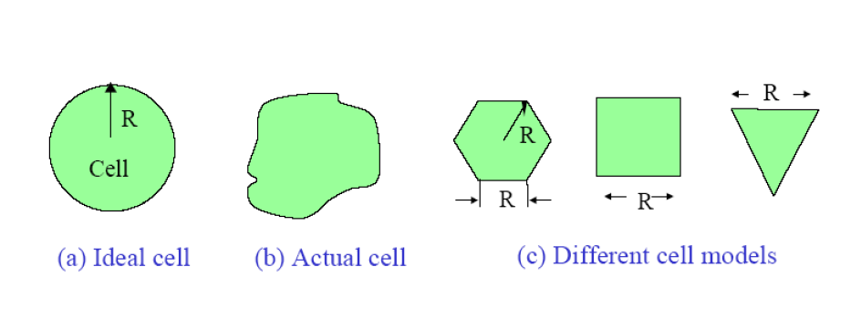

# 1. Cell

👉 A cell is an area where mobile phones use radio signals and are controlled by a BTS (Base Transceiver Station)

👉 Simple: Cell = coverage area of one BTS tower

👉 All phones inside this area are served by that BTS

---

## 📊 Network performance depends on:

- Number of users  
- How often they call  
- How long they talk  

---

## 📌 Easy line:

Cell = Area covered by one BTS

---

# 2. Cell Area

In a cellular system, the most important factor is the size and shape of a cell. A cell is the radio area covered by one Base Station (BS). All mobile stations (MS) within that area are connected and served by that BS.

The actual shape of a real cell is determined by the received signal strength in the surrounding area — it is not a perfect shape. However, for analysis and planning purposes, we use simplified models.

---

## 📐 Cell shape models used:

- Ideal cell — modeled as a perfect circle (radius R)  
- Actual cell — irregular shape depending on terrain and obstacles  
- Cell models for analysis — hexagon, square, or triangle shapes are used  

---

## 📌 Note:

The hexagon is the most commonly used model because it best represents how cells tile together without gaps or overlaps.

---

## 🖼️ Cell Shape Models Diagram

