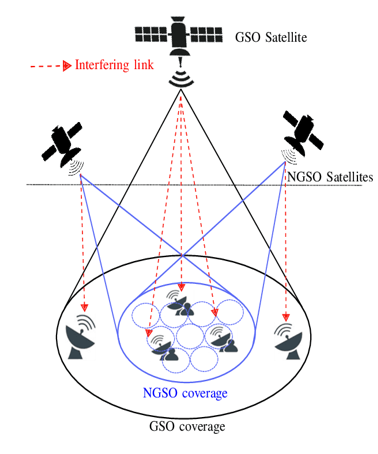
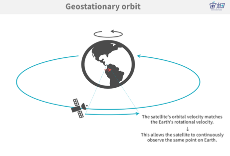
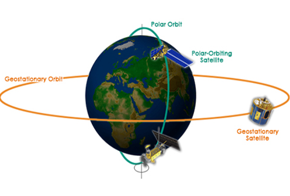
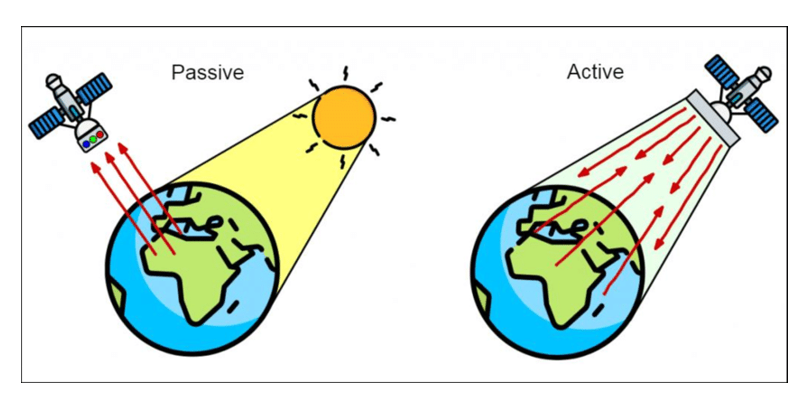
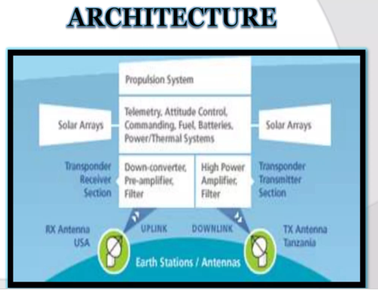

# Satellite

A satellite is a man-made object placed in space around the Earth to collect information or for communication. Earth is also technically a satellite because it moves around the Sun.

---

# Satellite Communication

Satellite communication is a system that works like a radio relay station in space above the Earth. It receives amplifies, and sends back analog and digital signals on a specific radio frequency. It is very important in the global telecommunication system.

---

## 📡 Elements of Satellite Communication

There are two major elements of a satellite communication system:

1. Space Segment  
2. Ground Segment  

---

# Basic Flow of Satellite Communication

A user sends data through a terrestrial (স্থলজ) system → earth station → antenna → uplink to satellite → satellite receives and retransmits → downlink → receiving antenna → earth station → terrestrial system → destination user.

###  Satellite Communication Flow Diagram

---

# Space Segment

## 📌 Space Segment includes:

• The satellite itself  
• Means for launching the satellite  
• Electrical power system  
• Mechanical structure  
• Communication transponders  
• Communication antennas  
• Attitude and orbit control system  

###  Space Segment Diagram

---

# Ground Segment

## 📌 Ground Segment consists of:

• Earth stations  
• Rear ward communication links  
• User terminals and interfaces  
• Network control center  
• Transmit equipment  
• Receive equipment  
• Antenna system  

### 🖼️ Ground Segment Diagram

<!-- Add image link here -->

---

# Satellite Control Centre Functions

## 📌 Functions:

• Tracking of the satellite  
• Receiving data  
• Eclipse management of the satellite  
• Commanding the satellite for station keeping  
• Determining orbital parameters from tracking and ranging data  
• Switching ON/OFF of different subsystems as per operational requirements  

---

# Orbits for Satellite Communication

An orbit is the path a satellite follows around the planet. Satellite orbits are divided into two main categories:

1. Non-Geostationary Orbit (NGSO)  
2. Geo Stationary Orbit (GSO)  

### 🖼️ Orbit Categories Diagram

---

# Satellite Orbits by Height

## 🛰️ LEO (Low Earth Orbit)

• Height: 160 to 1600 km above Earth  
• Small and easy to launch  
• Suitable for mass production  
• Used for high-speed data communication  

---

## 🛰️ MEO (Medium Earth Orbit)

• Height: 8000 to 18000 km above Earth  
• A compromise between LEO and GEO  
• Has more delay and needs higher power than LEO  

---

## 🛰️ GEO (Geostationary Earth Orbit)

• Height: 35,786 km above the equator  
• This is the geostationary orbit  

---

## 🛰️ HEO (High Elliptical Orbit)

• Height: 18,500 to 35,000 km above Earth  
• Satellite moves close to Earth and then far into space repeatedly  
• Gives better coverage to high northern and southern areas  

###  Satellite Orbits by Height Diagram

<!-- Add image link here -->

---

# Non-Geostationary Orbit (NGSO)

Early satellite communication used non-geostationary low earth orbits because launch vehicles had technical limitations in placing satellites in higher orbits.

---

## 📌 Classification of NGSOs by orbital plane:

### 🛰️ Polar Orbit

• The satellite moves from pole to pole  
• Inclination angle is exactly 90 degrees  

---

### 🛰️ Equatorial Orbit

• The orbital plane moves with the Earth's equatorial plane  
• Inclination is zero or very small  

---

### 🛰️ Inclined Orbit

• Any orbit that is neither polar nor equatorial falls into this category  

###  NGSO Orbit Diagram

<!-- Add image here -->

---

# Classification of NGSOs by direction

## 🛰️ Prograde Orbit

• The satellite that moves in the same direction as Earth's rotation  
• Inclination is between 0° and 90°  

---

## 🛰️ Retrograde Orbit

• The satellite moves in the opposite direction to Earth's rotation  
• Inclination is between 90° and 180°  

###  Orbit Direction Diagram

---

# Advantages of NGSO

• Less booster power needed  
• Less delay in transmission  
• Reduced echo problem in voice communication  
• Better for higher latitude areas  
• Lower cost to build and launch satellites  

---

# Disadvantages of NGSO

• Complex handoff problem between satellites  
• Shorter satellite lifetime  
• Requires frequent satellite replacement compared to GSO  
• Increases space debris (ধ্বংসাবশেষ) problem  
• Needs many satellites for global coverage  
• Each LEO satellite covers only a small area for a short time  

### NGSO Diagram

---

# Geostationary Orbit (GSO)

There is only one geostationary orbit around the Earth. It is on the Earth's equatorial plane. A satellite in this orbit moves at the same speed as the Earth rotates, so the satellite appears fixed (stationary) from the ground. As a result,

Because the satellite appears fixed, the ground station antenna does not need to rotate or track it, which reduces cost.

### Geostationary Orbit Diagram

---

# Key Facts about GSO

• One geostationary satellite can cover 38% of the Earth's surface  
• Three geostationary satellites can cover the whole Earth  
• Doppler shift effect is very small  

---

# Advantages of GSO

• Simple ground station tracking  
• Nearly constant transmission range  
• Very small frequency shift  
• No need for rotating antenna  
• Wide coverage area  

---

# Disadvantages of GSO

• Transmission delay is about 250 milliseconds  
• Large free space loss because of long distance  
• No polar coverage from geostationary orbit  

###  GSO Diagram

---

# Evolution of Satellite Communication

During the early 1950s, both passive and active satellites were explored for long-distance communication.

---

# Passive Satellites

A passive satellite only reflects signals from one earth station to another. It reflects incoming electromagnetic signals without any modification or amplification. It cannot generate power; it only bounces the signal back.

---

## 📌 Disadvantages of Passive Satellites

• Earth stations needed very high transmission power  
• Large and expensive earth stations with tracking systems were required  
• A global system would need many passive satellites used randomly for many users  
• Cannot be controlled from the ground  
• High signal loss due to long distance between transmitter and receiver  

---

👉 Passive satellites were used in early years, but later they were replaced by active satellites.

---

# Active Satellites

Active satellites amplify, modify, and retransmit signals that is received from Earth. Any satellite that can transmit power is called an active satellite.

---

## 📌 Advantages over Passive Satellites

• Require lower power earth stations  
• Less costly to operate  
• Not open to random unauthorized use  
• Can be controlled from the ground  

---

## 📌 Disadvantages of Active Satellites

• Require larger and more powerful rockets to launch heavier satellites  
• Need on-board power supply  
• Service interruptions can occur if electronic components fail  

### Passive & Active Satellite:

---

# Satellite Architecture

A satellite internally consists of these main parts working together:

• The RX Antenna receives the uplink signal from the earth station  
• It goes to the Transponder Receiver Section which contains a down converter, pre-amplifier, and filters  
• The signal is processed in the middle section  
• Then it goes to the Transponder Transmitter Section which has a high power amplifier and filter  
• Finally the TX Antenna sends the downlink signal back to Earth  
• Solar Arrays provide power on both sides  
• The whole system is managed by telemetry, attitude control, commanding, fuel, batteries, and power/thermal control (AOCS and TT&C)  

### Satellite Architecture Figure:

---

# Propulsion Subsystem

The propulsion subsystem generates thrust to move and maintain the satellite in space by expelling propellant, based on Newton’s Third Law of Motion. It is used for orbit adjustment, trajectory control, and maintaining orientation during the satellite’s lifetime.

---

# AOCS — Attitude and Orbit Control System

## 📌 Main Functions:

• Attitude Determination — uses sensors (star trackers, sun sensors, gyroscopes, magnetometers) to find satellite orientation  

• Attitude Control — adjusts orientation using reaction wheels, thrusters, and magnetic torquers  

• Telemetry Generation — collects health data (voltage, temperature, pressure, fuel) and sends to ground  

• Command Execution — receives ground commands for orbit, payload, or software changes  

• Autonomous Operation and Safe Mode — switches to safe mode automatically during faults  

• Station-Keeping — uses thrusters to keep satellite in correct orbital position  

---

## 📌 AOCS Components:

• Sensors: GPS, star trackers, IMU, CESS, magnetometers  

• Actuators: magnetic torquers, reaction wheels, thrusters  

• Operating modes: stand-by, normal, safe  

---

# Thermal Control

Satellites face temperature differences because one side gets sunlight while the other faces cold space. Heat is also generated inside the satellite and must be removed. For All these purpose Thermal Control is used.

---

## 📌 Methods used:

• Thermal blankets  
• Radiation mirrors  
• Heaters when transponders are off  

---

# Transponders

A transponder is a set of connected units that forms one communication channel between receiving and transmitting antennas of a satellite.

• Each transponder bandwidth: 36 MHz  
• Total: 12 transponders in 500 MHz  
• Total C-band bandwidth: 500 MHz  
• Divided into sub-bands (one per transponder)  
• Guard band: 4 MHz between transponders  

---

# Antenna Look Angles

Antenna look angles are the specific coordinates to which an earth station antenna must be pointed to establish a direct line-of-sight link with a satellite. Two angles are involved:

• Azimuth — the horizontal direction the antenna must face.  
• Elevation — the vertical angle above the horizon.  

These angles are calculated based on the earth station's latitude and longitude and the satellite's orbital position. Getting these right is essential for maximizing signal strength. For geostationary satellites, once set these angles don't need to change since the satellite is always in the same position relative to the ground.

---