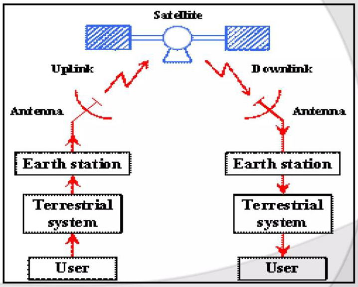
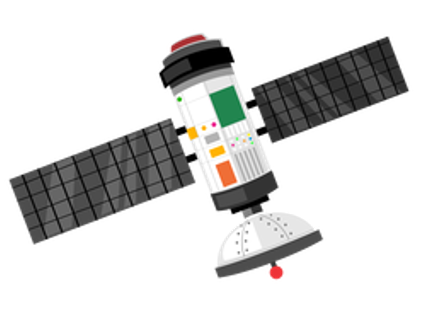
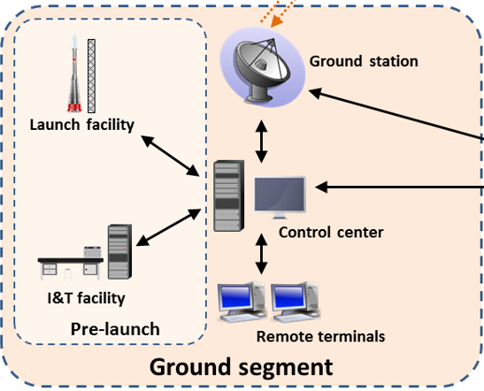
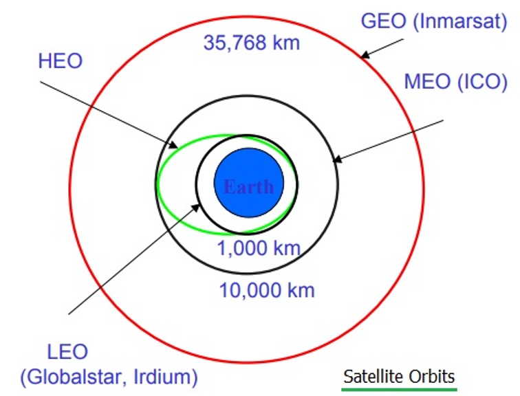
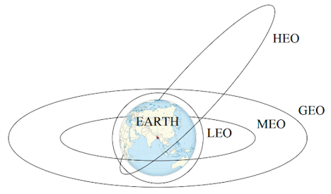
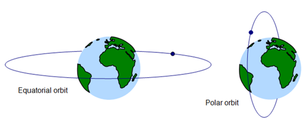
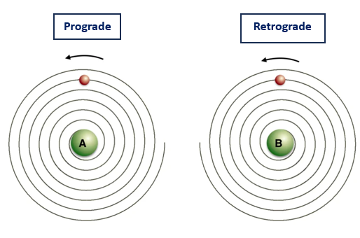

# Satellite

A satellite is a man-made object placed in space around the Earth to collect information or for communication. Earth is also technically a satellite because it moves around the Sun.

---

# Satellite Communication

Satellite communication is a system that works like a radio relay station in space above the Earth. It receives amplifies, and sends back analog and digital signals on a specific radio frequency. It is very important in the global telecommunication system.

---

## 📡 Elements of Satellite Communication

There are two major elements of a satellite communication system:

1. Space Segment  
2. Ground Segment  

---

# Basic Flow of Satellite Communication

A user sends data through a terrestrial (স্থলজ) system → earth station → antenna → uplink to satellite → satellite receives and retransmits → downlink → receiving antenna → earth station → terrestrial system → destination user.

###  Satellite Communication Flow Diagram

---

# Space Segment

## 📌 Space Segment includes:

• The satellite itself  
• Means for launching the satellite  
• Electrical power system  
• Mechanical structure  
• Communication transponders  
• Communication antennas  
• Attitude and orbit control system  

###  Space Segment Diagram

---

# Ground Segment

## 📌 Ground Segment consists of:

• Earth stations  
• Rear ward communication links  
• User terminals and interfaces  
• Network control center  
• Transmit equipment  
• Receive equipment  
• Antenna system  

### 🖼️ Ground Segment Diagram

<!-- Add image link here -->

---

# Satellite Control Centre Functions

## 📌 Functions:

• Tracking of the satellite  
• Receiving data  
• Eclipse management of the satellite  
• Commanding the satellite for station keeping  
• Determining orbital parameters from tracking and ranging data  
• Switching ON/OFF of different subsystems as per operational requirements  

---

# Orbits for Satellite Communication

An orbit is the path a satellite follows around the planet. Satellite orbits are divided into two main categories:

1. Non-Geostationary Orbit (NGSO)  
2. Geo Stationary Orbit (GSO)  

### 🖼️ Orbit Categories Diagram

---

# Satellite Orbits by Height

## 🛰️ LEO (Low Earth Orbit)

• Height: 160 to 1600 km above Earth  
• Small and easy to launch  
• Suitable for mass production  
• Used for high-speed data communication  

---

## 🛰️ MEO (Medium Earth Orbit)

• Height: 8000 to 18000 km above Earth  
• A compromise between LEO and GEO  
• Has more delay and needs higher power than LEO  

---

## 🛰️ GEO (Geostationary Earth Orbit)

• Height: 35,786 km above the equator  
• This is the geostationary orbit  

---

## 🛰️ HEO (High Elliptical Orbit)

• Height: 18,500 to 35,000 km above Earth  
• Satellite moves close to Earth and then far into space repeatedly  
• Gives better coverage to high northern and southern areas  

###  Satellite Orbits by Height Diagram

<!-- Add image link here -->

---

# Non-Geostationary Orbit (NGSO)

Early satellite communication used non-geostationary low earth orbits because launch vehicles had technical limitations in placing satellites in higher orbits.

---

## 📌 Classification of NGSOs by orbital plane:

### 🛰️ Polar Orbit

• The satellite moves from pole to pole  
• Inclination angle is exactly 90 degrees  

---

### 🛰️ Equatorial Orbit

• The orbital plane moves with the Earth's equatorial plane  
• Inclination is zero or very small  

---

### 🛰️ Inclined Orbit

• Any orbit that is neither polar nor equatorial falls into this category  

###  NGSO Orbit Diagram

<!-- Add image here -->

---

# Classification of NGSOs by direction

## 🛰️ Prograde Orbit

• The satellite that moves in the same direction as Earth's rotation  
• Inclination is between 0° and 90°  

---

## 🛰️ Retrograde Orbit

• The satellite moves in the opposite direction to Earth's rotation  
• Inclination is between 90° and 180°  

###  Orbit Direction Diagram

